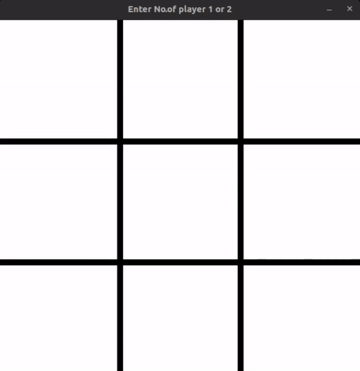
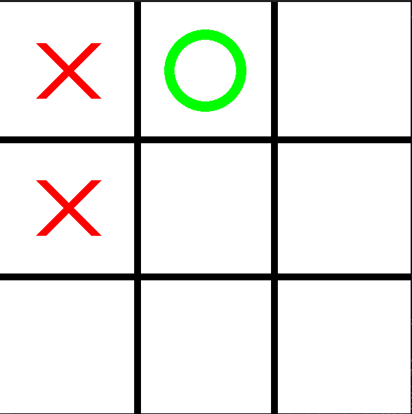
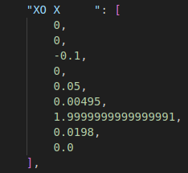

# Tic-Tac-Toe with Reinforcement Learning (SARSA Update Policy)

<div align="center">
  
</div>


## Overview

This project introduces a Python implementation of Tic Tac Toe, where the agent learns optimal strategies through Model-Free Reinforcement Learning (RL) employing the SARSA (State-Action-Reward-State-Action) update policy. The game is treated as a Markov Decision Process (MDP), establishing a structured environment for the agent's learning journey. Combining the Greedy Monte Carlo method with an off-policy exploration strategy, the agent systematically hones its decision-making abilities across multiple gameplay experiences. This dual approach contributes to the agent's acquisition of effective strategies for playing Tic Tac Toe. 

## Environment
Created a Tic Tac Toe game using the Pygame module, featuring two modes: single-player and two-player. In the two-player mode, it functions as a classic Tic Tac Toe game, allowing two players to take turns. The single-player mode introduces a unique twist, enabling players to engage with an AI model as their opponent.

## Agent Model
The game board state is captured in a string of length 9. The logic checks for empty positions and assigns a ticker if available. The agent's move involves choosing a number from 0 to 8, corresponding to array positions representing the board. Following training, the state-action table is saved into a JSON file.

## Reward Policy
The reward policy strategically motivates the agent by offering positive reinforcements (0.5 and 1) for both defensive and offensive moves, fostering the development of powerful and versatile gameplay strategies in the Tic Tac Toe environment.

    1)For Every Move:
        Reward: 0
        Explanation: No immediate reward is given for any regular move, providing a neutral signal to the agent.

    2)Stopping Opponent from Winning:
        Reward: 0.5
        Explanation: A positive reward of 0.5 is given when the agent makes a move that prevents the opponent from winning. This encourages the agent to prioritize defensive moves.

    3)Winning Move:
        Reward: 1
        Explanation: A reward of 1 is assigned when the agent makes a move that leads to its own victory. This incentivizes the agent to actively pursue winning strategies.

    4)Agent Winning the Game:
        Reward: 1 (End Game)
        Explanation: When the agent wins the game, it receives a higher reward of 1. This reinforces successful strategies and encourages the agent to strive for a winning outcome.

    5)Agent Losing the Game:
        Reward: -1 (End Game)
        Explanation: If the agent loses the game, it receives a negative reward of -1. This signals to the agent that losing is unfavorable and encourages it to avoid suboptimal moves.

## Update Policy
The SARSA (State-Action-Reward-State-Action) update policy is a fundamental component of reinforcement learning algorithms. It is grounded in the temporal difference learning approach and serves to update the Q-values (state-action values) within the agent's Q-table.

         Q(s,a)←Q(s,a)+α⋅[r+γ⋅Q(s′,a′)−Q(s,a)]

Here's a breakdown of each term in the equation:

    Q(s,a): The current estimate (Q-value) of the state-action pair (s,a)(s,a).

    α: The learning rate, which determines the step size of the update. It controls how much the new information will overwrite the old values.

    r: The immediate reward received after taking action aa in state ss.

    γ: The discount factor, which determines the importance of future rewards. It scales the value of the Q-value for the next state-action pair.

    Q(s′,a′): The Q-value of the next state-action pair (s′,a′). It represents the estimated future rewards.

##### Update Function  used Agent
        state_action[state][action]=state_action[state][action]+alpha*(reward+gamma*(max(state_action[nxtstate]))-state_action[state][action])
The '**state_action**'  dictionary functions as the state-action mapping, with a learning rate ('**alpha**') set to 0.1 and a discount factor ('**gamma**') of 0.99. In this context, 'state' represents the current state, 'action' signifies the agent's chosen action, and '**nxtstate**' corresponds to the resulting state after the agent takes the specified action.

## Training
Employing a self-training technique, I instantiated two model objects and facilitated 1 million episodes where they played against each other. Following these interactions, the state-action tables of each model were saved in JSON file format.there is a Training.py which starts this self-training

## Images
<table>
  <tr>
    <td align="center">
      
      <p>State</p>
    </td>
    <td align="center">
      
      <p>State Action Table</p>
    </td>
  </tr>
</table>


## Game play full Video

<video width="640" height="360" controls>
    <source src="./temp/GamePlay.mp4" type="video/mp4">
    Your browser does not support the video tag.
</video>


## Run Locally
Clone the project

```bash
  git clone https://github.com/SValanukonda/ReinforcementLearning-TicTacToe.git
```

Go to the project directory

```bash
  cd my-project
```

Install dependencies

```bash
  pip install -r requirements.txt
```

Start the Game

```bash
  run the play.py to Start Game
```

